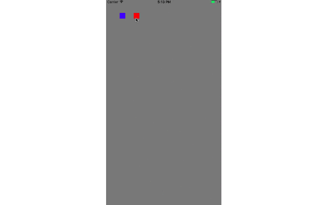

# SRLoadingHudView

-- 

## How to use it:
	let hud = SRLoadingHudView(frame: CGRect(x: 85, y: 80, width: 150, height: 150))
	hud.ballColor = UIColor.black
	hud.ballRadius = CGFloat(15)
	hud.shouBlur = false
	hud.showHud
	
	// hud.dismissHud